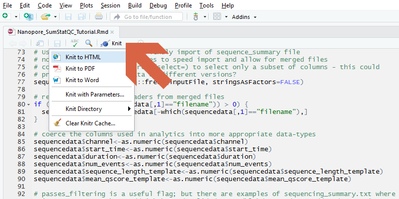

******************

# 1. Introduction:


### Overview:

The **Summary Statistics and QC tutorial** is intended as a functional guide to help assess the quality characteristics of a single Nanopore sequence run. This tutorial aims to enable an objective assessment of the performance of a Nanopore flowcell run and to assess the sequence characteristics to benchmark quality. 

### Features:

Sufficient information is provided in the tutorial such that the workflow can be tested, validated, and replicated. The tutorial is provided with an example dataset from a barcoded sequence library. The tutorial is intended to address important questions;

* how many reads (and how many gigabases) were sequenced?
* what fraction of my sequence collection is good quality?
* how are longer sequence reads represented in my sample?
* how uniform is the representation of different barcodes?

******************

# 2. Getting Started:


### Input and Output: 

This tutorial uses the R markdown contained within this Github repository, a **`sequence_summary.txt`** file from the Guppy base-calling software, and optionally a **`barcoding_summary.txt`** file from Guppy barcoding as input. Example summary files are included within the repository. The result of the tutorial will be a tutorial document in **`html`** format. This workflow can also process the `sequence_summary.txt` file prepared by the **`albacore`** base calling software/

### Dependencies:

This tutorial requires a computer running Linux (Centos7, Ubuntu 18_10, Fedora 29) - 8Gb of memory would be recommended.  The tutorial has been tested on minimal server installs of these operating systems.

Other dependencies include

* **`Conda`** is required by this tutorial and orchestrates and manages the installation of other required software
* **`R`** is a statistical analysis software and is used for the analysis and reporting of the sequence summary data
* **`Rstudio`** is a graphical user interface to **`R`** and provides much of the required reporting framework 
* **`git`** packages for downloading the tutorial from Github repository. 
* **`git-lfs`** is required to download the sequence and metadata files provided with the tutorial. 


### Installation:

1. Most software dependecies are managed though **`conda`**, install as described at  <br> [https://conda.io/docs/install/quick.html](https://conda.io/docs/install/quick.html).
```
    wget https://repo.anaconda.com/miniconda/Miniconda3-latest-Linux-x86_64.sh
    bash Miniconda3-latest-Linux-x86_64.sh
    bash
```
2. Download Nanopore QC tutorial & example files into a folder named `QCTutorial`. This tutorial requires the **`git-lfs`** large file support capabilities; this should be installed first through **`conda`**
```
    conda install -c conda-forge git-lfs
    git lfs install
    git clone https://github.com/nanoporetech/ont_tutorial_basicqc.git QCTutorial
```
3. Change working directory into the new `QCTutorial` folder
```
    cd QCTutorial
```
4. Install conda software dependencies with
```
    conda env create --name BasicQC --file environment.yaml
```
5. Initialise conda environment with 
```
    source activate BasicQC
```


#### Compilation From Source

This tutorial does not contain software that requires compilation.


### Usage: 

In your Conda environment, and in the tutorial working directory,

1. *optional* edit the provided **`config.yaml`** file to match your own study design
2. Render the tutorial report using the command
```
    R --slave -e 'rmarkdown::render("Nanopore_SumStatQC_Tutorial.Rmd", "html_document")'
```

The provided Rmarkdown tutorial script can also be opened directly in Rstudio

```
rstudio Nanopore_SumStatQC_Tutorial.Rmd
```

The report can be prepared by "knit" from the GUI as shown in the figure




******************

# 3. Results

This tutorial workflow will produce a rich description of your sequence characteristics as observed from the starting **`sequence_summary.txt`** file. Please visit the tutorial page at [https://community.nanoporetech.com/knowledge/bioinformatics]( https://community.nanoporetech.com/knowledge/bioinformatics) for more information

******************

# 4. Help:

### Licence and Copyright:

© 2019 Oxford Nanopore Technologies Ltd.

Bioinformatics-Tutorials are distributed by Oxford Nanopore Technologies under the terms of the MPL-2.0 license.

### FAQs:


### Abbreviations:


* __knit__ is the command to render an Rmarkdown file. The knitr package is used to embed code, the results of R analyses and their figures within the typeset text from the document. 

* __L50__  the number of sequences (or contigs etc) that are longer than, or equal to, the N50 length and therefore include half the bases of the assembly

* __N50__  length such that sequences (or contigs etc) of this length or longer include half the bases of the sequence collection

* __Rmarkdown__ is an extension to markdown. Functional R code can be embedded in a plain-text document and subsequently rendered to other formats including the PDF format of this report.

* __QV__  the quality value - -log10(p) that any given base is incorrect. QV may be either at the individual base level, or may be averaged across whole sequences

* __sequencing_summary.txt__ a summary file describing sequence characteristics following base calling with the Guppy / Albacore software.


### References and Supporting Information:

*  https://community.nanoporetech.com/knowledge/bioinformatics
*  https://www.r-project.org/
*  https://snakemake.readthedocs.io/en/stable/
*  https://bioconda.github.io/

